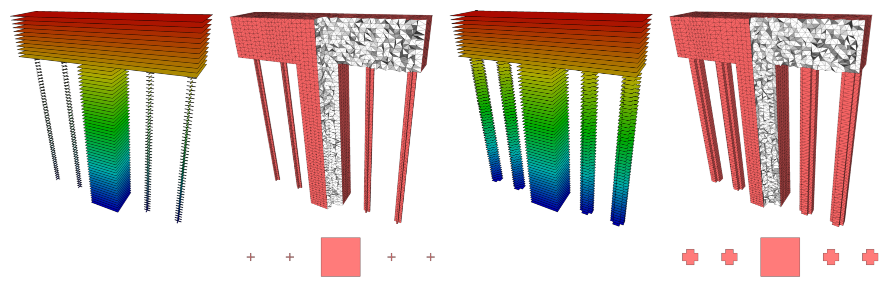

# slice2mesh: a direct mesher of sliced data for the simulation of AM processes

[Marco Livesu](http://pers.ge.imati.cnr.it/livesu/), [Daniela Cabiddu](http://www.imati.cnr.it/index.php/people/8-curricula/119-daniela-cabiddu), [Marco Attene](http://pers.ge.imati.cnr.it/attene/PersonalPage/attene.html)
([CNR IMATI](http://www.imati.cnr.it))

**(paper coming soon)**

slice2mesh inputs sliced data for a 3D printer, and outputs a slice conformal volumetric mesh to accurately simulate the fabrication process. Encoding the temporal evolution of the printed object, the mesh faithfully represents the simulation domain at any time during fabrication.

